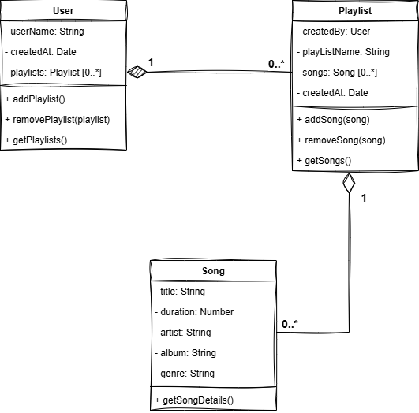

# Client Meeting: Spotitunes Playlist Feature
**Participants:**
- **Client (Tom)** – Entrepreneur and visionary for Spotitunes.
- **Dev Team Lead (Alice)** – Lead developer representing the dev team.
- **Junior Developer (James)** – Member of the dev team, quietly observing.

---

**Tom**: "So, I have this incredible idea. It’s called **Spotitunes**. Everyone's doing music streaming nowadays, but nobody has done it like this. I'm focusing on **playlists**. People love playlists! My investors are asking for a quick demo to get them excited. I need you guys to build something that shows how awesome the playlist feature is."

**Alice**: "Okay, so we are focusing just on **playlists** for this demo. Can you explain a bit more about what you envision for this feature?"

**Tom**: "Yeah, yeah! Users should be able to create **multiple playlists**. Each playlist will contain **songs**—songs with artists, albums, genres, you know? We’ll start simple with strings for those. We can expand later. But for now, let’s make it simple—just get the playlists to work, make them feel smooth."

**Alice**: "Got it. So, for the playlist, users create them, and they can add and remove songs, right?"

**Tom**: "Exactly! And I hate duplicates. No duplicates, please. If a song’s already in the playlist, the system should let the user know but not add it again."

**Alice**: "Understood. What details do you want stored for the **songs**?"

**Tom**: "Just the essentials. I want the **title**, **artist**, **album**, **duration** of the song, and the **genre**. The key part here is that songs can belong to an artist and album, but no need to overcomplicate it—just strings for now."

**Alice**: "So just strings for those fields, keeping it simple. How about the **users**—are we focusing on them for this demo?"

**Tom**: "Yes, users can create as many playlists as they want. Each user will have their own playlists. But for now, no user profile stuff—just focus on how they manage playlists. We'll worry about the fancy stuff later."

**Alice**: "Sounds good. One last thing—what do you want as the deliverable for this demo? How will we measure if it’s ready?"

**Tom**: "I want to show my investors how a user can create a playlist, add songs to it, remove songs, and manage them. We’ll see how the flow works. If that goes well, we can expand into more complex features like user profiles or custom recommendations. But right now, we’re scoped to the basics—playlists and songs."

**James** (quietly): "So, this is like a **basic playlist manager**, right?"

**Tom**: "Exactly, James! You got it! Let’s nail this, and we’ll be swimming in investment offers."

---

# Meeting Summary
1. **Scope**: 
   - Focus on the **playlist feature** for Spotitunes. 
   - Users can create **multiple playlists**.
   - Playlists contain **songs**.
   
2. **Songs**:
   - Each song will have the following details:
     - **Title** (string)
     - **Duration** (integer, in seconds)
     - **Artist** (string)
     - **Album** (string)
     - **Genre** (string)

3. **Playlists**:
   - Users can add and remove songs.
   - **Duplicate songs** should be avoided—if a song is already in the playlist, it won’t be added again, and a message will be logged.

4. **Users**:
   - Users can create **multiple playlists**.
   - A user’s playlists will be stored, but for now, no user profile or login functionality is required—just focus on playlist management.

5. **Deliverable**:
   - A simple **demo** showing a user creating a playlist, adding and removing songs, and managing the playlist. This is the core functionality for investors to see.
   
---

# Class Diagram Summary
From this meeting, we derive the following **class structure** for the playlist manager:

1. **Class: Playlist**
   - **Attributes**: 
     - `createdBy` (User)
     - `playListName` (string)
     - `songs` (Array of Song objects)
     - `createdAt` (Date object)
   - **Methods**:
     - `addSong(song)` – Adds a song to the playlist.
     - `removeSong(song)` – Removes a song from the playlist.
     - `getSongs()` – Returns the list of songs.

2. **Class: Song**
   - **Attributes**:
     - `title` (string)
     - `duration` (integer, in seconds)
     - `artist` (string)
     - `album` (string)
     - `genre` (string)
   - **Methods**:
     - `getSongDetails()` – Returns formatted details about the song.

3. **Class: User**
   - **Attributes**:
     - `userName` (string)
     - `createdAt` (Date object)
     - `playlists` (Array of Playlist objects)
   - **Methods**:
     - `addPlaylist(playlist)` – Adds a playlist for the user.
     - `removePlaylist(playlist)` – Removes a playlist for the user.
     - `getPlaylists()` – Returns the list of playlists.

---

Below is a class diagram that was sketched based on the requirements.

